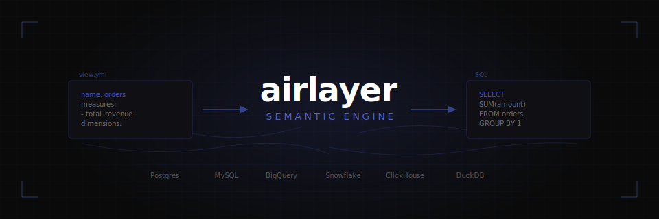

<p align="center">
  
</p>

# airlayer

An in-process semantic engine that compiles `.view.yml` definitions into dialect-specific SQL — and optionally executes queries against real databases. Built in Rust as both a library and CLI tool.

## Quick start

```bash
bash <(curl -sSfL https://raw.githubusercontent.com/oxy-hq/airlayer/main/install_airlayer.sh)
```

Then initialize a project within an empty directory:

```bash
mkdir my-project && cd my-project
airlayer init
```

This connects to your database, discovers your schema, and generates `config.yml`, `.view.yml` files, and [Claude Code](https://docs.anthropic.com/en/docs/claude-code) sub-agents for querying and building your semantic layer.

## Example

Given a `views/orders.view.yml`:

```yaml
name: orders
table: public.orders
dialect: postgres

dimensions:
  - name: status
    type: string
    expr: status

measures:
  - name: total_revenue
    type: sum
    expr: amount
```

You can query it with the CLI as follows:

```bash
# add -x to execute against the database
airlayer query \
  --dimension orders.status \
  --measure orders.total_revenue \
  --filter orders.status:equals:active \
  --limit 10
```

Which will compile to the following SQL, returned to stdout:

```sql
SELECT
  "orders".status AS "orders__status",
  SUM("orders".amount) AS "orders__total_revenue"
FROM public.orders AS "orders"
WHERE ("orders".status = 'active')
GROUP BY 1
LIMIT 10
```

## Two modes: project mode and library mode

airlayer can be used in two ways:

**Project mode (CLI)** — You have a directory with `config.yml`, `views/`, and optionally `motifs/` and `queries/`. The `config.yml` file anchors the project: all CLI commands auto-detect the project root by walking up from the current directory until they find it. This means you can run commands from any subdirectory without specifying `--config`:

```bash
cd my-project/views/          # anywhere inside the project
airlayer query -x --measure orders.total_revenue   # just works
airlayer inspect --motifs                           # just works
airlayer query queries/revenue_investigation.query.yml -x  # just works
```

**Library mode (Python / JS / Rust)** — You embed airlayer as a library and pass view definitions, motifs, and queries programmatically. No `config.yml` or filesystem structure is needed — everything is constructed in code. Available as a [Python package](https://pypi.org/project/airlayer/) and an [npm package](https://www.npmjs.com/package/airlayer) (WebAssembly).

```python
import airlayer

result = airlayer.compile(
    views_yaml=[open("views/orders.view.yml").read()],
    query_json='{"measures": ["orders.total_revenue"], "dimensions": ["orders.status"]}',
    dialect="postgres",
)
print(result["sql"])
```

```js
import init, { compile } from 'airlayer';
await init();

const result = compile(
  [ordersViewYaml],
  JSON.stringify({ measures: ['orders.total_revenue'], dimensions: ['orders.status'] }),
  'postgres'
);
console.log(result.sql);
```

## Development

This project uses [`just`](https://github.com/casey/just) as a task runner. Install with `cargo install just`, then run `just` to see all available recipes.

```bash
just build                # core only (no database drivers)
just build-all            # with all database drivers
just build-wasm           # WebAssembly package (output in pkg/)
just build-python         # Python package (dev install into current venv)
just build-python-release # Python wheel (release)
just test                 # tier 1: unit tests + in-process integration (DuckDB, SQLite)
just test-docker          # tier 2: starts Docker DBs + runs tests
just test-cloud           # tier 3: Snowflake, BigQuery, MotherDuck
just test-all             # all tiers
just lint                 # clippy lints
just fmt                  # format code
```

See [docs/testing.md](docs/testing.md) for the full three-tier testing strategy.

## Documentation

| Document | Description |
|----------|-------------|
| [PHILOSOPHY.md](PHILOSOPHY.md) | Design principles |
| [docs/schema-format.md](docs/schema-format.md) | `.view.yml` reference — dimensions, measures, entities, segments |
| [docs/query-api.md](docs/query-api.md) | Query format, filter operators, time dimensions |
| [docs/agent-execution.md](docs/agent-execution.md) | Execution envelope spec, config format |
| [docs/architecture.md](docs/architecture.md) | Pipeline stages: parse → resolve → plan → generate |
| [docs/dialects.md](docs/dialects.md) | Per-dialect SQL behavior |
| [docs/testing.md](docs/testing.md) | Three-tier testing strategy |
| [docs/library-usage.md](docs/library-usage.md) | Python, JS/WASM, and Rust library API |
| [npm package](https://www.npmjs.com/package/airlayer) | WebAssembly build for browsers and Node.js |
| [PyPI package](https://pypi.org/project/airlayer/) | Native Python package |
| [DEVELOPMENT.md](DEVELOPMENT.md) | Contributing and release workflow |
